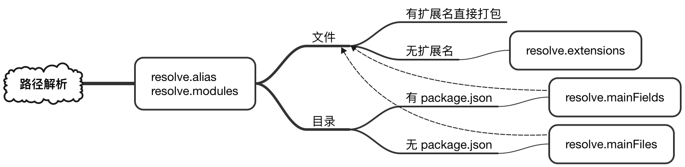

## 模块的路径解析

路径解析器（resolver）用来查找模块的绝对路径。模块当作依赖项，被其他模块引入：

```js
import foo from 'path/to/module'
require('/path/to/module')
```

被依赖的模块可能来自应用自身，也可能来自第三方框架。路径解析器帮助 webpack 理解 `import` 或 `require` 模块的实际路径，以便将其中的代码引入。

webpack 解析模块路径时，使用了 `enhanced-resolve` 库。

### webpack 的路径解析规则

基于 `enhanced-resolve`，webpack 可以解析三种类型的路径：

#### 绝对路径

```js
import '/home/me/file'
import 'C:\\Users\\me\\file'
```

因为已经是绝对路径，所以无需进一步解析。

#### 相对路径

```js
import '../src/file1'
import './file2'
```

这种情况下，`import` 语句所在的模块，即模块消费方的路径会被当作上下文路径（context direcotry）。相对路径和上下文路径结合，生成最终的绝对路径。

#### 模块路径

```js
import 'module'
import 'module/lib/file'
```

`resolve.modules` 指定了搜索模块的所有路径。可以通过 `resolve.alias` 创建别名替换模块的原本地址。

当模块经过上面规则解析后，路径解析器会检查路径指向的是文件还是目录。如果路径指向文件：

- 如果路径包含扩展名，直接被打包
- 否则，使用 `resolve.extensions` 选项猜测可能的扩展名。

如果路径指向目录，需要经过以下步骤才可以找到正确的文件：

- 如果目录包含 `package.json` 文件，会遍历 `resolve.mainFields` 选项列出的字段，第一个匹配的字段值决定了文件路径
- 如果目录没有 `package.json` 文件，或字段中没有合法的路径名，会遍历 `resolve.mainFiles` 列出的字段，检查有无匹配的文件。
- 文件扩展名的解析规则与 `resolve.extensions` 选项规则一致。

webpack 会根据不同的编译目标提供相应的默认值。



### 参考文献

- [Module Resolution](https://webpack.js.org/concepts/module-resolution/) - webpack.js.org
- [enhanced-resolve](https://github.com/webpack/enhanced-resolve) - github.com
- [configuration/resolve](https://webpack.js.org/configuration/resolve/) - webpack.js.org