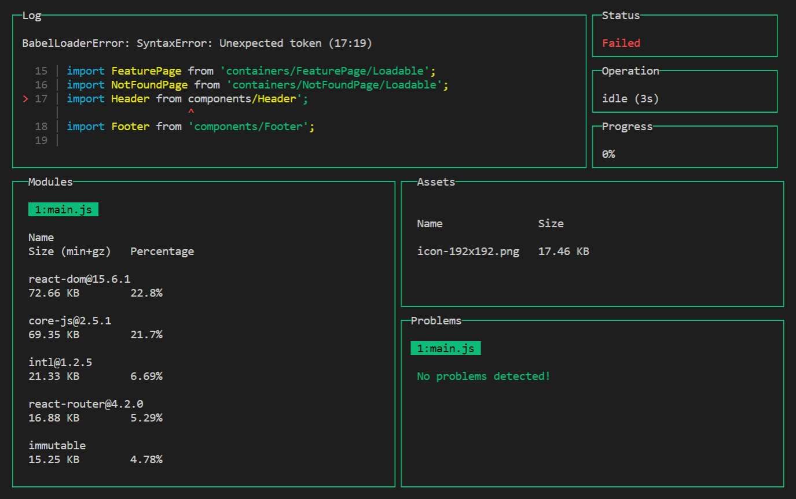

# 检测和分析

即是你成功配置 webpack ，使得打包出来的代码特别小，还是需要跟踪它，知道它里面包含了什么。否则，你可能安装了一个依赖，让你的 app 体积增大一倍，你却毫无所知。

本章节列举了一些工具，帮你理解 bundle 内容。

## 跟踪 bundle 体积

为了监控 app 体积，可以在开发时使用 [webpack-dashboard][webpack-dashboard]，在持续集成时使用 [bundlesize][bundlesize]。

### webpack-dashboard

webpack-dashboard 增强了 webapck 的输出，可以看到依赖的尺寸，进度和其他细节。以下是它的截图：



这个仪表盘可以跟踪大型项目的依赖 - 如果新增一个模块，会立刻在 Modules 区域看到！

为了启用它，需要安装 `webpack-dashboard` 包：

```sh
npm install webpack-dashboard --save-dev
```

然后将其添加至配置文件的 `plugins` 数组：

```js
/** webpack.config.js */
const DashboardPlugin = require('webpack-dashboard/plugin')

module.exports = {
  plugins: [
    new DashboardPlugin(),
  ],
}
```

如果你使用了基于 Express 的开发服务器，可以使用 `compiler.apply`：

```js
compiler.apply(new DashboardPlugin())
```

然后在 `package.json` 中的 `scripts` 字段增加如下属性：

```json
{
  "scripts": {
    "start": "webpack-dashboard -- webpack-dev-server -d --hot --config webpack.config.js --watch"
  }
}
```

这样，就可以使用 `npm start` 开启 `webpack-dashboard` 了。

可以多次尝试调整仪表盘参数，看看是否可以找到优化的地方。比如，在 Modules 区域滚动查看，看看哪些库太大，可以被更小的所代替。

### bundlesize

bundlesize 确保 webpack 资源的体积在限定值以下。将它和 CI 整合可以在资源变得过大时报警。

下面是配置方法：

**找到最大的体积**

1. 优化 app，使其体积尽量小。执行生产构建。
2. 在 `package.json` 中增加 `bundlesize` 字段，写入以下内容：

```json
{
  "bundlesize": [
    {
      "path": "./dist/*"
    }
  ]
}
```

3. 使用 `npx` 执行 `bundlesize`

```sh
npx bundlesize
```

这会列出每个文件的压缩尺寸：

```sh
PASS  ./dist/icon256.6168aaac8461862eab7a.png: 10.89KB
PASS  ./dist/icon512.c3e073a4100bd0c28a86.png: 13.1KB
PASS  ./dist/main.0c8b617dfc40c2827ae3.js: 16.28KB
PASS  ./dist/vendor.ff9f7ea865884e6a84c8.js: 31.49KB
```

4. 为每个尺寸增加 10~20%，就能得到最大体积。10~20% 的余量可以保证你正常开发 app，并且当体积过大时给予警告。

**开启 `bundlesize`**

5. 安装 `bundlesize`，作为开发依赖

```sh
npm install bundlesize --save-dev
```

6. 在 `package.json` 的 `bundlesize` 区域，设定实际的最大值。对于某些文件（比如，图像），可能会根据文件类型来设定最大尺寸，而不是所有文件一视同仁。

```json
{
  "bundlesize": [
    {
      "path": "./dist/*.png",
      "maxSize": "16 kB",
    },
    {
      "path": "./dist/main.*.js",
      "maxSize": "20 kB",
    },
    {
      "path": "./dist/vendor.*.js",
      "maxSize": "35 kB",
    }
  ]
}
```

7. 增加一个 npm 脚本

```json
{
  "scripts": {
    "check-size": "bundlesize"
  }
}
```

8. 配置 CI，在每次 push 后执行 `npm run check-size`。（也可以在 Github 上整合 bundlesize）

大功告成！如果你运行 `npm run check-size` 或提交代码，你会知道是否文件足够小。

延伸阅读

- Alex Russel 的应该关注的[实际场景的加载时间][performance-budgets]

## 分析 bundle 超重的原因

你可能深入 bundle 内部，了解哪些模块占据了多大空间。试试 [webpack-bundle-analyzer][webpack-bundle-analyzer] 吧。

webpack-bundle-analyzer 会扫描整个 bundle，建立内部模块的可视化图表。使用这个图表可以看到哪个模块体积最大，哪个模块是多余的。

要使用分析器，需要安装它：

```sh
npm install webpack-bundle-analyzer --save-dev
```

在 webpack 配置文件中增加插件：

```js
/** webpack.config.js */
const BundleAnalyzerPlugin = require('webpack-bundle-analyzer').BundleAnalyzerPlugin

module.exports = {
  plugins: [
    new BundleAnalyzerPlugin(),
  ],
}
```

然后构建。插件会在浏览器中自动打开统计图表。

> ✨ 注意：如果你使用了 ModuleConcatenationPlugin，它可能会在 webpack-bundle-analyzer 合并一部分模块，让报告细节丢失。如果使用了这个插件，记得在分析时禁用它。

记得阅读 Sean Larkin 的精彩博文 [webpack bundle 的分析][webpack-bundle]。

## 总结

- 使用 `webpack-dashboard` 和 `bundlesize` 监测 app 代码尺寸
- 使用 `webpack-bundle-analyzer` 深入研究各个模块的尺寸

## REF

- [Monitor and analyze the app][google], by Ivan Akulov

[google]: https://developers.google.com/web/fundamentals/performance/webpack/monitor-and-analyze
[webpack-dashboard]: https://github.com/FormidableLabs/webpack-dashboard/
[bundlesize]: https://github.com/siddharthkp/bundlesize
[performance-budgets]: https://infrequently.org/2017/10/can-you-afford-it-real-world-web-performance-budgets/
[webpack-bundle-analyzer]: https://github.com/webpack-contrib/webpack-bundle-analyzer
[webpack-bundle]: https://medium.com/webpack/webpack-bits-getting-the-most-out-of-the-commonschunkplugin-ab389e5f318